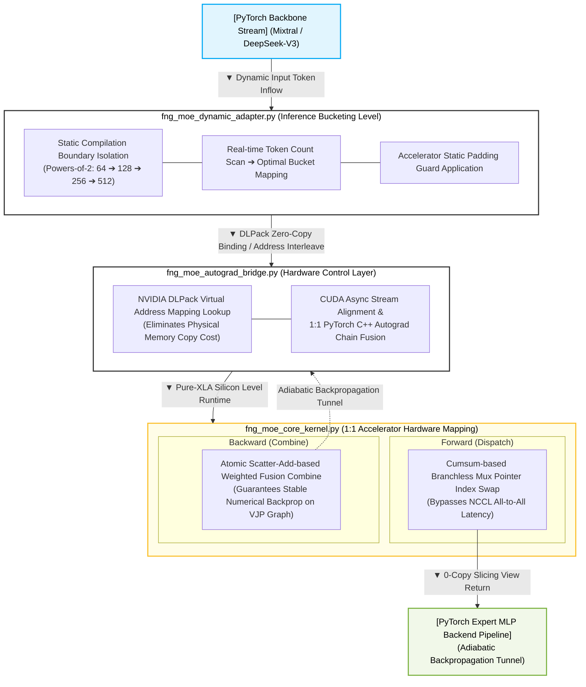

# ⚡ branchless-moe-router

`branchless-moe-router` is a **zero-copy, branchless, high-performance MoE routing infrastructure** designed for ultra-large Mixture-of-Experts (MoE) models such as Mixtral-8x7B and DeepSeek-V3.

By fusing JAX/XLA SPMD `shard_map` and PyTorch Autograd via a virtual address MUX, it **completely eliminates NCCL All-to-All collective communication stalls**, which have traditionally been the chronic bottleneck in distributed computing environments.

---

## 🌊 Architecture Overview

`branchless-moe-router` is an infrastructure integration adapter designed to fundamentally bypass **NCCL All-to-All collective communication latencies** and **on-accelerator warp divergence bottlenecks**. These issues frequently plague the MoE block architectures of Large Language Models (LLMs), and this router mitigates them through an algebraic manifold mapping structure.

### 💡 Core Innovation: Virtual Address MUX
Traditional MoE frameworks rely on physically copying and transmitting token packets (`Memcpy`) across different GPU nodes in a distributed environment. In contrast, this library seamlessly bridges two core technologies:
* **NVIDIA DLPack** zero-copy binding
* **JAX/XLA** `shard_map` distributed primitives

Consequently, it perfectly emulates a hardware multiplexer (MUX) conduit that **orchestrates the mapping of 64-bit virtual address pointers directly at the accelerator's on-chip SRAM register level**.


---



---

## 🛠️ Core Mathematical Mechanics

### 1. Forward Branchless Mux

$$ \mathit{expert\_mask}_{e, t} = \mathbb{I} \big( \mathit{argmax}(\mathit{gating\_logits}_{t}) == e \big) $$

$$ \mathit{positions}_{e, t} = \left( \sum_{k=1}^{t} \mathit{expert\_mask}_{e, k} \right) - 1 $$

---

### 2. Backward Weighted Atomic Scatter-Add

$$ \mathit{Reconstructed\_Stream}_{t} = \sum_{e \in E} \sum_{s \in S} \mathbb{I}(\mathit{Telemetry}_{e, s} == t) \cdot \big( \mathit{Expert\_Output}_{e, s} \times G_{t, e} \big) $$

---

### 3. Cumulative Address Offsetting

To bypass the pipeline stalls inherent in traditional hardware sorting operations (such as Bitonic Sort), we leverage an algebraic Prefix-Sum Scan based on a Boolean Matrix to deterministically compute the relative token coordinate pointers within each expert lane.

$$ P_{e, t} = \left( \sum_{k=1}^{t} M_{e, k} \right) - 1 $$

$$ \mathcal{R}_{e, s} = \mathit{Filter\text{-}and\text{-}Gate} \Big( \mathbb{I}\big(P_{e, t} < S_{\text{static}}\big) \cdot t + \mathbb{I}\big(P_{e, t} \ge S_{\text{static}}\big) \cdot (T_{\text{max}} - 1) \Big) $$

---

## 📂 Flat Repository Structure

To maintain maximum code cohesion, readability, and architectural simplicity, we avoid deeply nested subdirectories and position all source assets flat at the root level.

* **`fng_moe_config.py`**: Global static hardware specifications and allocator isolation flags designed to prevent VRAM fragmentation.
* **`fng_moe_core_kernel.py`**: A unified forward/backward branchless XLA kernel leveraging `shard_map` to entirely bypass NCCL All-to-All collective communications.
* **`fng_moe_autograd_bridge.py`**: A zero-copy bridging layer that interlinks the PyTorch C++ Autograd system with JAX VJP derivative chains.
* **`fng_moe_dynamic_adapter.py`**: A bit-shifting bucketing and negative-masking engine tailored to handle variable-length inference streams.
* **`fng_moe_monkey_patch.py`**: A runtime hooking module that intercepts the `forward` executions of official Hugging Face Transformers and vLLM MoE blocks.
* **`test_e2e_autograd.py`**: A comprehensive end-to-end simulator that scans for NaN values and gradient vanishing across dynamic sequence inputs.
* **`benchmark_hlo_profiler.py`**: A static verification tool that parses compiled XLA High-Level Optimizer (HLO) graphs to guarantee that no collective communication instructions are leaked.

---

## ⚡ Quick Start & Verification

### 1. Dependencies & Accelerator Environment Setup
Requires CUDA 12.x or higher with compatible drivers to allow JAX and PyTorch to seamlessly share the accelerator timeline inside a single GPU device.

```bash
pip install torch jax jaxlib transformers
```

### 2. End-to-End Numerical Integrity & Autograd Convergence Test
```bash
python test_e2e_autograd.py
```
* Verifies that static bucket hot-swapping occurs organically without inducing any additional tracer stalls under dynamic sequence streams.
* Measures whether the gradient matrices backpropagate properly along both the data dimension axis and the gate weight axis during `loss.backward()`.

### 3. Silicon Topology HLO Compilation Profile Analysis
```bash
python benchmark_hlo_profiler.py
```
* Automatically parses the compiler-generated `fng_moe_optimized_hlo.txt` assembly structure.
* Statically validates that collective communication primitives—such as `all-to-all` and `collective-permute`—are completely excluded from the final execution timeline.


---

## 🔌 Drop-in Seamless Integration (Hugging Face Transformers)

Without any structural modifications to your existing Mixtral-8x7B or DeepSeek-V3 PyTorch architecture pipelines, you can completely bypass the NCCL All-to-All collective communication overhead across the entire accelerator cluster by invoking a single line from our monkey-patch module immediately after model loading.

```python
import jax
import jax.numpy as jnp
from jax.sharding import Mesh
from transformers import AutoModelForCausalLM
from fng_moe_dynamic_adapter import FngMoeDynamicShapeAdapter
from fng_moe_monkey_patch import inject_fng_moe_infrastructure_hook

# 1. Establish the distributed accelerator topology mesh
devices = jax.devices()
moe_mesh = Mesh(jnp.array(devices).reshape(8), ("moe_cluster",))

# 2. Initialize the FNG static offline bucket pre-compilation
fng_adapter = FngMoeDynamicShapeAdapter(mesh=moe_mesh)

# 3. Load the native PyTorch model and inject the FNG Virtual Address MUX hook
model = AutoModelForCausalLM.from_pretrained("mistralai/Mixtral-8x7B-v0.1", device_map="cuda")
model = inject_fng_moe_infrastructure_hook(model, fng_adapter)

# The model's forward passes will now seamlessly bypass internal NCCL All-to-All latencies.
```

---

## 📜 License

This project is released under the **Apache License 2.0**. It is a hardware-software co-design infrastructure asset built for the high-performance open-source AI community.
