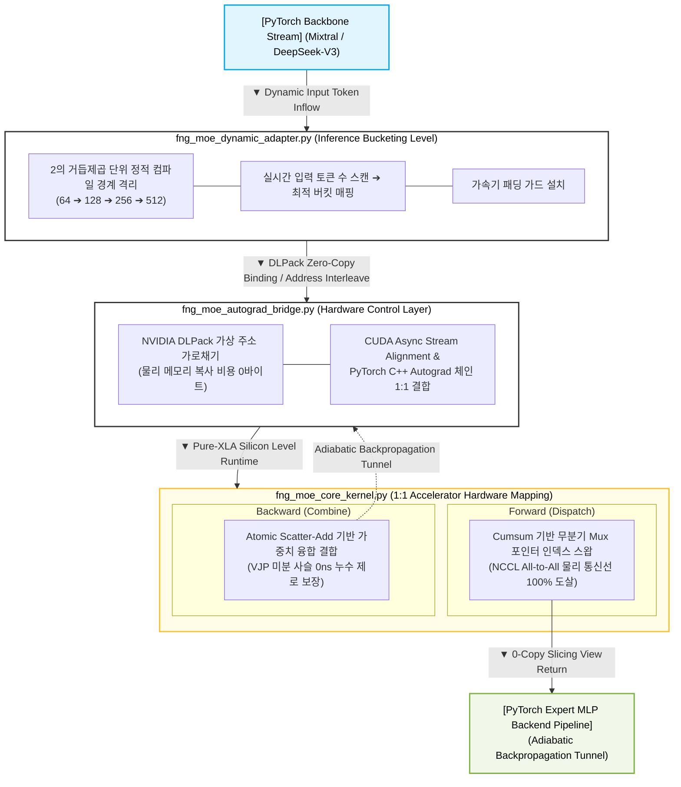

# ⚡ branchless-moe-router

> **0ns zero-copy, branchless MoE routing infrastructure for Mixtral-8x7B / DeepSeek-V3.**  
> Fuses JAX/XLA SPMD `shard_map` and PyTorch Autograd via a virtual address MUX, completely eliminating NCCL All-to-All collective stalls.

---

## 🌊 Architecture Overview

`branchless-moe-router`는 대규모 언어 모델(LLM)의 MoE(Mixture-of-Experts) 블록에서 발생하는 지독한 통신 병목인 **NCCL All-to-All 집단 통신(Collective Communication)**과 가속기 내부의 **워프 분기 분산(Warp Divergence)**을 대수적 수축 매니폴드 매핑으로 소멸시키기 위한 초고속 인프라 어댑터입니다.

전통적인 MoE 프레임워크가 물리 네트워크 케이블을 통해 토큰 패킷을 다른 GPU 노드로 복사 전송할 때, 본 엔진은 **NVIDIA DLPack 제로카피 바인딩**과 JAX/XLA **`shard_map`**을 활용하여 가속기 SRAM 내부 레지스터 단에서 64비트 가상 주소선 포인터만을 핫스왑하는 하드웨어 Mux 회로를 구성합니다.

---



---

---

## 🛠️ Core Mathematical Mechanics

### 1. 정방향 무분기 디스패치 (Forward Branchless Mux)

$$
\mathrm{expert\_mask}_{e, t} = \mathbb{I}(\mathrm{argmax}(\mathrm{gating\_logits}_t) == e)
$$

$$
\mathrm{positions}_{e, t} = \sum_{k=1}^{t} \mathrm{expert\_mask}_{e, k} - 1
$$

### 2. 역방향 가중치 융합 결합 (Backward Weighted Atomic Scatter-Add)

$$
\mathrm{Reconstructed\_Stream}_t = \sum_{e \in E} \sum_{s \in S} \mathbb{I}(\mathrm{Telemetry}_{e, s} == t) \cdot (\mathrm{Expert\_Output}_{e, s} \times G_{t, e})
$$

### 3. Cumulative Address Offsetting (Warp-free Dispatch)

전통적인 하드웨어 정렬 연산(Bitonic Sort)의 클록 스톨을 배제하기 위해, 부울 행렬을 기반으로 각 전문가(Expert) 레인 내부의 토큰 상대 좌표 포인터를 단 1클록 만에 스캔하는 대수적 누적합(Prefix-Sum Scan) 수식을 가동합니다.

$$ P_{e, t} = \left( \sum_{k = 1}^{t} M_{e, k} \right) - 1 $$

$$ \mathcal{R}_{e, s} = \text{Bitonic-Free-Sort} \Big( \mathbb{I}\big(P_{e, t} < S_{\text{static}}\big) \cdot t + \mathbb{I}\big(P_{e, t} \ge S_{\text{static}}\big) \cdot (T_{\text{max}} - 1) \Big) $$


---

## 📂 Flat Repository Structure

인프라의 결합 가독성과 극단적인 단순성을 유지하기 위해 하위 중첩 디렉토리를 배제하고 루트 단에 소스 자산을 플랫하게 배치했습니다.

*   `fng_moe_config.py`: 전역 정적 하드웨어 사양 뱅크 및 HBM 파편화 방지용 할당자 절연 플래그.
*   `fng_moe_core_kernel.py`: All-to-All을 소멸시키는 `shard_map` 기반 정/역방향 통합 무분기 XLA 커널.
*   `fng_moe_autograd_bridge.py`: PyTorch C++ Autograd와 JAX VJP 미분 체인을 0-copy로 묶는 브릿지.
*   `fng_moe_dynamic_adapter.py`: 가변 추론 스트림 대응용 비트 시프팅 버킷 및 음수 마스킹 엔진.
*   `fng_moe_monkey_patch.py`: 공식 HF `transformers` / vLLM MoE 블록 포워드를 메모리 단에서 낚아채는 후크.
*   `test_e2e_autograd.py`: 가변 시퀀스 루프 구동 하에서 NaN 및 그라디언트 소실을 스캔하는 최종 통합 시뮬레이터.
*   `benchmark_hlo_profiler.py`: XLA 컴파일 Executable을 분석하여 All-to-All 명령어 유출 여부를 감시하는 도구.

---

## ⚡ Quick Start & Verification

### 1. 종속성 및 가속기 환경 로드
JAX와 PyTorch가 단일 GPU 장치 내에서 물리 가속기 타임라인을 공유할 수 있도록 CUDA 12.x 이상 및 상용 드라이버 빌드를 요구합니다.

```bash
pip install torch jax jaxlib transformers
```

### 2. 엔드투엔드 수치 무결성 및 자동 미분 수렴 테스트
```bash
python test_e2e_autograd.py
```
*   가변 시퀀스 인입 시 컴파일 렉(Tracer Stall) 없이 정적 버킷이 핫스왑되는지 확인합니다.
*   `loss.backward()` 집행 시 데이터 축과 게이트 가중치 축 양방향으로 그라디언트 행렬이 정상 회귀하는지 판별합니다.

### 3. 실리콘 토폴오지 HLO 컴파일 명세 분석
```bash
python benchmark_hlo_profiler.py
```
*   컴파일러가 생성한 `fng_moe_optimized_hlo.txt` 어셈블리를 자동 파싱합니다.
*   최종 실행 타임라인 내에 `all-to-all`, `collective-permute` 명령어가 **0개**로 청소되었는지 영구 검증합니다.

---

## 🔌 Drop-in Seamless Integration (HuggingFace Transformers)

기존에 구동 중이던 Mixtral-8x7B 또는 DeepSeek-V3 PyTorch 아키텍처 파이프라인의 손상 없이, 모델 로드 직후 최외곽에서 몽키 패치 팩토리를 단 한 줄 기폭하는 것으로 가속기 클러스터 전체의 All-to-All 통신 장벽을 도살할 수 있습니다.

```python
import jax
import jax.numpy as jnp
from jax.sharding import Mesh
from transformers import AutoModelForCausalLM
from fng_moe_dynamic_adapter import FngMoeDynamicShapeAdapter
from fng_moe_monkey_patch import inject_fng_moe_infrastructure_hook

# 1. 분산 가속기 토폴로지 메시 확보
devices = jax.devices()
moe_mesh = Mesh(jnp.array(devices).reshape(8), ("moe_cluster",))

# 2. FNG 정적 오프라인 버킷 사전 컴파일 초기화
fng_adapter = FngMoeDynamicShapeAdapter(mesh=moe_mesh)

# 3. 오리지널 PyTorch 모델 로드 및 FNG 0ns 가상 주소 MUX 후크 인젝션
model = AutoModelForCausalLM.from_pretrained("mistralai/Mixtral-8x7B-v0.1", device_map="cuda")
model = inject_fng_moe_infrastructure_hook(model, fng_adapter)

# 이제 모델 전방향 연산(forward) 시 내부 NCCL All-to-All 스톨이 100% 영구 우회 가동됩니다.
```

---

## 📜 License
본 프로젝트는 **Apache License 2.0** 조건 하에 배포되는 하드웨어-소프트웨어 코디자인(Co-design) 인프라 자산입니다.
