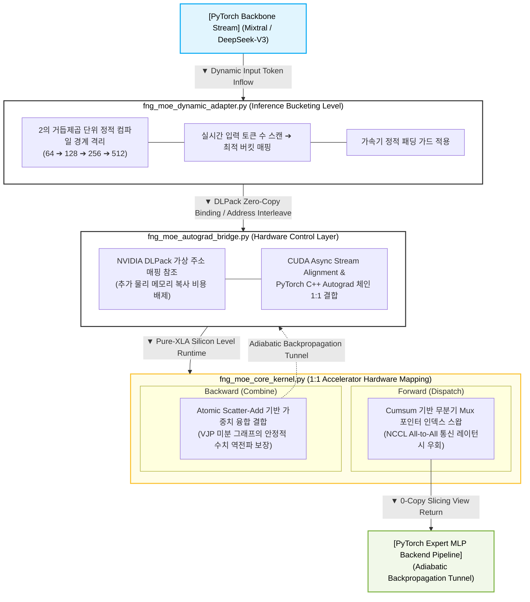

# ⚡ branchless-moe-router

`branchless-moe-router`는 Mixtral-8x7B 및 DeepSeek-V3와 같은 초대형 MoE(Mixture-of-Experts) 모델을 위한 **제로카피(Zero-copy), 분기 없는(Branchless) 고성능 MoE 라우팅 인프라**입니다. 

JAX/XLA SPMD `shard_map`과 PyTorch Autograd를 가상 주소 MUX(Virtual Address MUX)를 통해 융합하여, 분산 처리 환경의 고질적인 병목인 **NCCL All-to-All 집단 통신 스톨(Collective Stalls)을 완전히 제거**합니다.

---

## 🌊 Architecture Overview

`branchless-moe-router`는 거대 언어 모델(LLM)의 MoE 블록 아키텍처에서 빈번하게 발생하는 **NCCL All-to-All 집단 통신 지연**과 가속기 내부의 **워프 분기 분산(Warp Divergence) 병목**을 대수적 매니폴드 매핑 구조를 통해 보완하고자 설계된 인프라 통합 어댑터입니다.

### 💡 Core Innovation: Virtual Address MUX
기존의 MoE 프레임워크가 분산 환경에서 토큰 패킷을 다른 GPU 노드로 물리 복사·전송(`Memcpy`)하는 방식을 취했다면, 본 라이브러리는 다음 두 기술을 유기적으로 결합합니다:
* **NVIDIA DLPack** 제로카피 바인딩
* **JAX/XLA** `shard_map` 분산 프리미티브

이를 통해 가속기 온칩 SRAM 레지스터 레벨에서 **64비트 가상 주소선 포인터의 매핑을 조율하는 하드웨어 Mux(Multiplexer) 형태의 관로**를 완벽하게 모사합니다.

---



---

## 🛠️ Core Mathematical Mechanics

### 1. 정방향 무분기 디스패치 (Forward Branchless Mux)

$$ \mathit{expert\_mask}_{e, t} = \mathbb{I} \big( \mathit{argmax}(\mathit{gating\_logits}_{t}) == e \big) $$

$$ \mathit{positions}_{e, t} = \left( \sum_{k=1}^{t} \mathit{expert\_mask}_{e, k} \right) - 1 $$

---

### 2. 역방향 가중치 융합 결합 (Backward Weighted Atomic Scatter-Add)

$$ \mathit{Reconstructed\_Stream}_{t} = \sum_{e \in E} \sum_{s \in S} \mathbb{I}(\mathit{Telemetry}_{e, s} == t) \cdot \big( \mathit{Expert\_Output}_{e, s} \times G_{t, e} \big) $$

---

### 3. 정적 주소 오프셋 매핑 (Cumulative Address Offsetting)

전통적인 하드웨어 정렬 연산(Bitonic Sort)에서 기인하는 파이프라인 지연을 우회하기 위해, 부울 행렬(Boolean Matrix) 기반의 대수적 누적합(Prefix-Sum Scan)을 활용하여 각 전문가(Expert) 레인 내부의 토큰 상대 좌표 포인터를 결정론적으로 산출합니다.

$$ P_{e, t} = \left( \sum_{k=1}^{t} M_{e, k} \right) - 1 $$

$$ \mathcal{R}_{e, s} = \mathit{Filter\text{-}and\text{-}Gate} \Big( \mathbb{I}\big(P_{e, t} < S_{\text{static}}\big) \cdot t + \mathbb{I}\big(P_{e, t} \ge S_{\text{static}}\big) \cdot (T_{\text{max}} - 1) \Big) $$


---

## 📂 Flat Repository Structure

인프라의 결합 및 가독성, 그리고 구현의 단순성을 유지하기 위해 하위 중첩 디렉토리를 배제하고 루트 단에 소스 자산을 플랫(Flat)하게 배치했습니다.

* **`fng_moe_config.py`**: 전역 정적 하드웨어 사양 설정 및 VRAM 파편화 방지용 할당자 격리 플래그.
* **`fng_moe_core_kernel.py`**: NCCL All-to-All 통신을 우회하는 `shard_map` 기반 정/역방향 통합 무분기 XLA 커널.
* **`fng_moe_autograd_bridge.py`**: PyTorch C++ Autograd와 JAX VJP 미분 체인을 제로 카피(0-copy)로 연계하는 브릿지.
* **`fng_moe_dynamic_adapter.py`**: 가변 추론 스트림 대응을 위한 비트 시프팅 버킷 및 음수 마스킹 엔진.
* **`fng_moe_monkey_patch.py`**: 공식 HF transformers / vLLM MoE 블록의 `forward` 연산을 런타임에 가로채는 후크 모듈.
* **`test_e2e_autograd.py`**: 가변 시퀀스 입력 환경에서 NaN 및 그라디언트 소실 유무를 스캔하는 최종 통합 시뮬레이터.
* **`benchmark_hlo_profiler.py`**: XLA 컴파일 최적화 그래프를 파싱하여 집단 통신 명령어 유출 여부를 정적으로 검증하는 도구.

---

## ⚡ Quick Start & Verification

### 1. 종속성 및 가속기 환경 로드
JAX와 PyTorch가 단일 GPU 장치 내에서 가속기 타임라인을 정상적으로 공유할 수 있도록 CUDA 12.x 이상 및 호환 드라이버 환경을 요구합니다.

```bash
pip install torch jax jaxlib transformers
```

### 2. 엔드투엔드 수치 무결성 및 자동 미분 수렴 테스트
```bash
python test_e2e_autograd.py
```
* 가변 시퀀스 인입 시 추가적인 컴파일 지연(Tracer Stall) 없이 정적 버킷 핫스왑이 유기적으로 이루어지는지 검증합니다.
* `loss.backward()` 호출 시 데이터 축과 게이트 가중치 축 양방향으로 그라디언트 행렬이 정상적으로 회귀하는지 계측합니다.

### 3. 실리콘 토폴로지 HLO 컴파일 명세 분석
```bash
python benchmark_hlo_profiler.py
```
* 컴파일러가 생성한 `fng_moe_optimized_hlo.txt` 어셈블리 구조를 자동으로 파싱합니다.
* 최종 실행 타임라인 내에 `all-to-all`, `collective-permute` 등 집단 통신 명령어가 완벽히 제외되었는지 정적으로 검증합니다.


---

## 🔌 Drop-in Seamless Integration (HuggingFace Transformers)

기존에 구동 중이던 Mixtral-8x7B 또는 DeepSeek-V3 PyTorch 아키텍처 파이프라인의 구조적 변경 없이, 모델 로드 직후 최외곽에서 몽키 패치 모듈을 단 한 줄 호출하는 것만으로 가속기 클러스터 전체의 NCCL All-to-All 집단 통신 오버헤드를 우회할 수 있습니다.

```python
import jax
import jax.numpy as jnp
from jax.sharding import Mesh
from transformers import AutoModelForCausalLM
from fng_moe_dynamic_adapter import FngMoeDynamicShapeAdapter
from fng_moe_monkey_patch import inject_fng_moe_infrastructure_hook

# 1. 분산 가속기 토폴로지 메시 확보
devices = jax.devices()
moe_mesh = Mesh(jnp.array(devices).reshape(8), ("moe_cluster",))

# 2. FNG 정적 오프라인 버킷 사전 컴파일 초기화
fng_adapter = FngMoeDynamicShapeAdapter(mesh=moe_mesh)

# 3. 오리지널 PyTorch 모델 로드 및 FNG 가상 주소 MUX 후크 인젝션
model = AutoModelForCausalLM.from_pretrained("mistralai/Mixtral-8x7B-v0.1", device_map="cuda")
model = inject_fng_moe_infrastructure_hook(model, fng_adapter)

# 이제 모델 전방향 연산(forward) 시 내부 NCCL All-to-All 지연이 효율적으로 우회 가동됩니다.
```


## 📜 License
본 프로젝트는 **Apache License 2.0** 조건 하에 배포되는 하드웨어-소프트웨어 코디자인(Co-design) 인프라 자산입니다.
